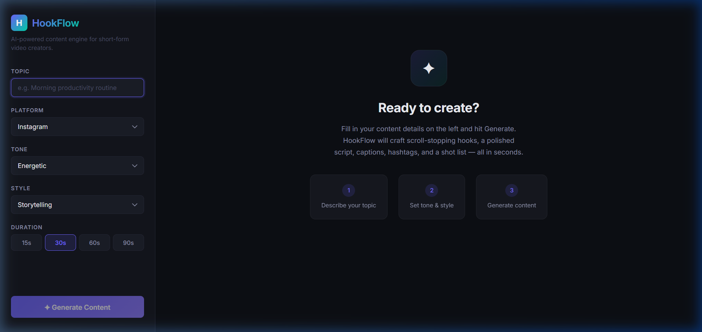
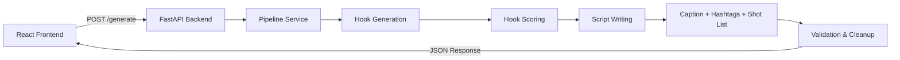

# 🚀 HookFlow

**HookFlow** is a full-stack AI-powered content generation engine that turns simple ideas into **high-engagement short-form content** — hooks, scripts, captions, hashtags, and shot lists — all in seconds.

Built for creators, marketers, and anyone producing content for **Instagram Reels**, **YouTube Shorts**, and **TikTok**.

🔗 **[Try the Live Demo →](https://hook-flow-sand.vercel.app/)**



---

## ⚡ Features

- 🎯 **Hook-first generation** — Creates multiple hooks, scores them, and picks the strongest
- 🧠 **Multi-step AI pipeline** — Not a single prompt; a structured 6-stage pipeline
- 🎬 **Full content suite** — Scripts with pacing, captions, hashtags, and shot lists
- 🔁 **Retry + validation** — Built-in error handling for consistent, structured outputs
- 🎨 **9 content styles** — Default, Storytelling, Educational, Cinematic, Documentary, Vlog, Listicle, Funny, Dark
- 🌐 **Deployed & live** — Frontend on Vercel, backend on Render

---

## 🏗️ Architecture

```
User Input → FastAPI → Pipeline Service → Prompt Builders → Groq LLM → Validators → Structured JSON → React UI
```



---

## 🧠 Tech Stack

| Layer | Technology |
|-------|-----------|
| **Frontend** | React 19, Vite, Vanilla CSS (glassmorphism dark theme) |
| **Backend** | FastAPI, Python 3.11 |
| **LLM** | Groq API (LLaMA-based models) |
| **Deployment** | Vercel (frontend), Render (backend) |
| **Validation** | Custom rule-based validators with retry logic |

---

## 📂 Project Structure

```
HookFlow/
├── app/                          # FastAPI Backend
│   ├── main.py                   # App entry point + CORS config
│   ├── routes/
│   │   └── generate.py           # POST /generate endpoint
│   ├── models/
│   │   └── request_models.py     # Pydantic request/response models
│   ├── services/
│   │   ├── pipeline_service.py   # Multi-step content pipeline
│   │   ├── llm_service.py        # Groq API integration
│   │   └── style_service.py      # Style preset resolver
│   ├── prompts/
│   │   ├── base_prompt.py        # Shared prompt context builder
│   │   ├── hook_prompt.py        # Hook generation prompt
│   │   ├── hook_score_prompt.py  # Hook scoring/ranking prompt
│   │   ├── script_prompt.py      # Script generation prompt
│   │   ├── caption_prompt.py     # Caption generation prompt
│   │   ├── hashtag_prompt.py     # Hashtag generation prompt
│   │   └── shotlist_prompt.py    # Shot list generation prompt
│   ├── config/
│   │   ├── style_config.py       # 9 style presets with tone/audience
│   │   └── trend_config.py       # Platform trend data
│   └── utils/
│       ├── validators.py         # Output validation & cleanup
│       └── logger.py             # Logging utility
│
├── frontend/                     # React Frontend
│   ├── src/
│   │   ├── App.jsx               # Main app with API integration
│   │   ├── App.css               # Full glassmorphism dark theme
│   │   ├── main.jsx              # React entry point
│   │   └── components/
│   │       ├── InputForm.jsx     # Input sidebar (topic, platform, tone, style, duration)
│   │       ├── OutputPanel.jsx   # Results display panel
│   │       ├── SectionCard.jsx   # Collapsible content cards
│   │       └── CopyButton.jsx    # Copy-to-clipboard button
│   ├── package.json
│   ├── vite.config.js
│   └── index.html
│
├── render.yaml                   # Render deployment config
├── requirements.txt              # Python dependencies
├── .env                          # Environment variables (not committed)
└── .gitignore
```

---

## 📥 Getting Started

### Prerequisites
- Python 3.11+
- Node.js 18+
- A [Groq API key](https://console.groq.com/)

### 1. Clone the repository

```bash
git clone https://github.com/AmoghInfinity/HookFlow.git
cd HookFlow
```

### 2. Backend Setup

```bash
python -m venv venv
# macOS/Linux
source venv/bin/activate
# Windows
venv\Scripts\activate

pip install -r requirements.txt
```

Create a `.env` file in the root:

```env
GROQ_API_KEY=your_groq_api_key_here
```

Start the backend:

```bash
uvicorn app.main:app --reload
```

Backend runs at: `http://127.0.0.1:8000`

### 3. Frontend Setup

```bash
cd frontend
npm install
npm run dev
```

Frontend runs at: `http://localhost:5173`

---

## 📡 API Reference

### `POST /generate`

#### Request Body

```json
{
  "topic": "Street food in Lucknow",
  "platform": "Instagram",
  "tone": "Funny",
  "style": "Storytelling",
  "duration": 30
}
```

#### Response

```json
{
  "status": "success",
  "data": {
    "hook_options": ["Hook 1", "Hook 2", "Hook 3"],
    "selected_hook": "The winning hook",
    "script": "Full structured script...",
    "caption": "Engaging caption with emojis...",
    "hashtags": ["#streetfood", "#lucknow", "..."],
    "shot_list": [
      {
        "shot": 1,
        "description": "Close-up of sizzling kebabs",
        "duration": "3s"
      }
    ]
  }
}
```

---

## 🚀 Deployment

### Backend → Render (Free)

1. Connect the repo on [render.com](https://render.com)
2. Render auto-detects `render.yaml`
3. Add environment variables: `GROQ_API_KEY`, `FRONTEND_URL`

### Frontend → Vercel (Free)

1. Import the repo on [vercel.com](https://vercel.com)
2. Set **Root Directory** to `frontend`
3. Add environment variable: `VITE_API_URL` = your Render backend URL

---

## 🔍 Key Design Decisions

- **Multi-step pipeline** over single-prompt for significantly better output quality
- **Hook-first strategy** — the hook drives the entire content generation
- **Validation layer** ensures structured, parseable outputs every time
- **Retry mechanism** with configurable attempts for LLM reliability
- **Case-insensitive style matching** between frontend and backend
- **Environment-based configuration** for seamless local ↔ production switching

---

## ⚠️ Limitations

- Dependent on LLM response quality and Groq API availability
- No caching layer (every request calls the LLM)
- No rate limiting on the API
- Free Render tier spins down after 15 min of inactivity (~30s cold start)

---

## 🔮 Future Improvements

- [ ] Streaming responses for real-time generation feedback
- [ ] Hook analytics and A/B testing
- [ ] Multi-language support
- [ ] User accounts and content history
- [ ] Voice-over and video generation
- [ ] Parallel LLM calls for faster pipeline execution

---

## 👤 Author

Built by **[Amogh Gupta](https://github.com/AmoghInfinity)**

---

## ⭐ Support

If you find this useful, consider giving the repo a star!
